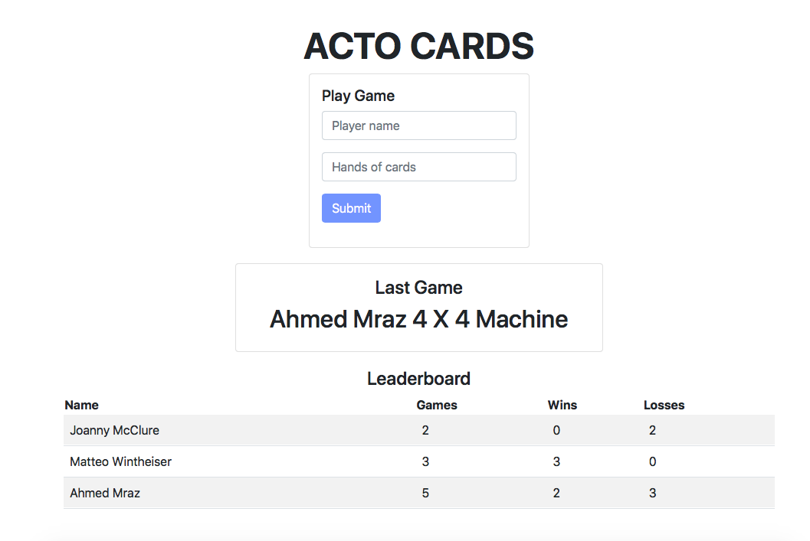
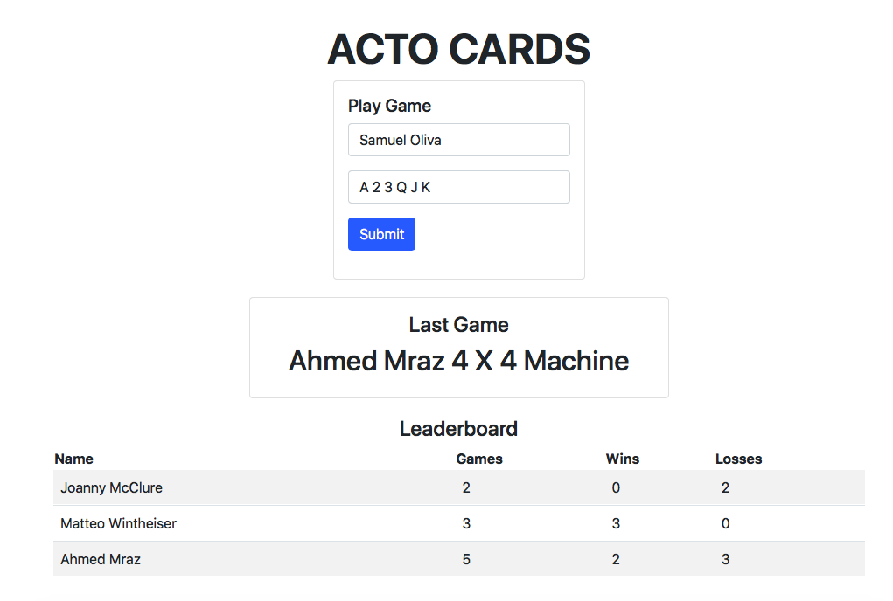
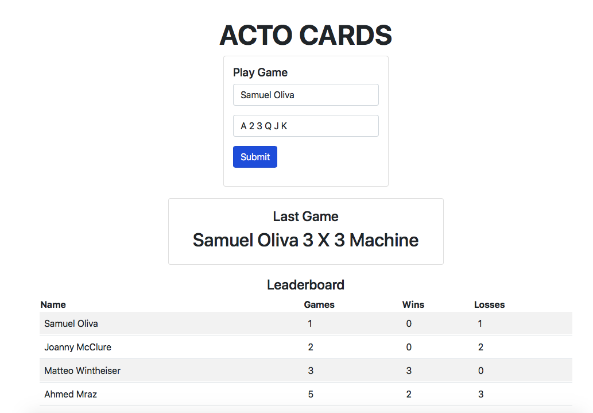

# ActoCards

## Basic information

Acto cards is a game in which the player provides a hand of valid cards, for example, "2 4 6 J K A" then the machine generate a random hand from a set of valid cards (2, 3, 4, 5, 6, 7, 8, 9, 10, J, Q, K, A).

After submiting the scores are computed and a Score component shows the result of the last game and a Leaderboard table component shows the number of games, wins and losses of all players.

### Example:

The images below presents examples of the api working.

- ActoCards interface 


- Example of a player inputting a hand of cards


- Result after submitting the player hand



## Setting up the API

The api is developed with PHP, Laravel and Postgres (it works with other DBMSs).

- To set the database, firstly you need to create the a database in your DBMS. For example:
```
CREATE TABLE ActoCards;
```

- Create or edit the .env file with the database info. For example:
```
DB_CONNECTION=pgsql
DB_HOST=localhost
DB_PORT=5432
DB_DATABASE=ActoCards
DB_USERNAME=password
DB_PASSWORD=password
```

- Run the following commands to create the table using the developed laravel migration:
```
php artisan migrate 
```

- Run the following command to populate the table with the developed Factory and Seeder:
```
php artisan make:seeder GameSeeder
```

- Finally run laravel server
```
php artisan serve
```

- The vue interface was developed, run the following commands to assure that it works properly 
```
npm install
npm install vuex --save
npm run dev # or npm run watch 
```

- Finally you can access the API in the browser using:
http://localhost:8000


